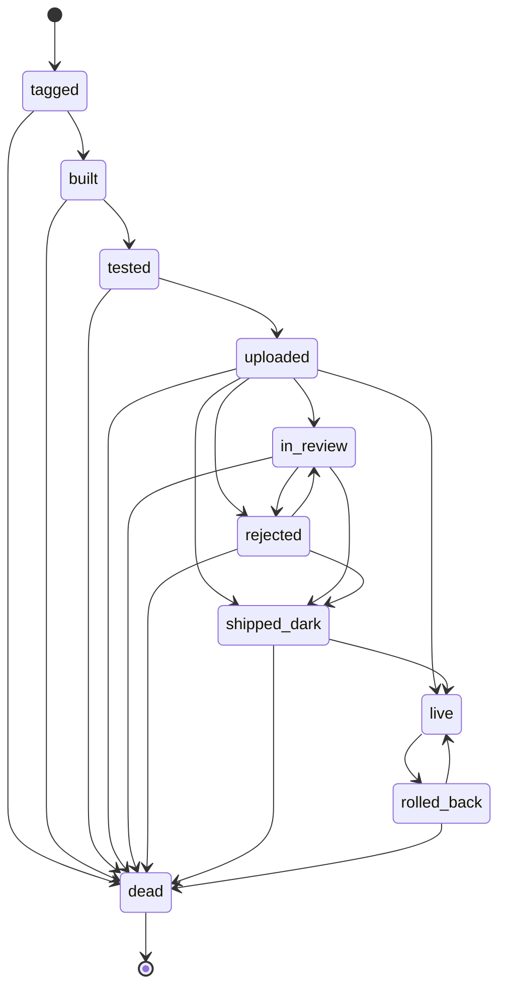

# Halyard

**An event-driven release coordinator that models a multi-platform launch — iOS, Android,
web, desktop — as one durable state machine.**

Shipping the same feature to four platforms isn't a pipeline. A pipeline is a single linear
run, and that model breaks the moment mobile review enters the picture: no CI job can sit open
for the hours-to-days an App Store review takes. Halyard replaces the pipeline with an
**event-driven state machine backed by a durable, git-backed coordinator** — CI, store-review
polls, the flag provider, and Sentry are all just event sources on the same bus. A *halyard* is
the line you haul to raise a flag; here the **flag flip, not the store approval, is the real
launch**, and raising it is a deliberate human action: `halyard flip --flag launch.aurora.offline_sync --state on`.

Built as a reusable spine (CLI + library + CI workflows) for a multi-app shop. Runs **fully
offline** with git-backed defaults — `npm run demo` walks a real launch end-to-end in a temp
dir, no accounts required.

> **30-second tour:** the [state machine](#the-state-machine) · how it
> [recovers from failed transitions](#failure--recovery) · the [quickstart](#quickstart) ·
> an [honest status](#status--what-is-real). Full design rationale lives in
> [`design.md`](design.md); this README is the operator manual below the fold.

---

## The state machine

Every release moves along the edges below and no others. The graph is defined once, in code, as
[`LEGAL_TRANSITIONS`](src/halyard/coordinator/state-machine.ts); this diagram is **checked
against that map by a test** ([`tests/state-diagram-doc.test.ts`](tests/state-diagram-doc.test.ts)),
so it can never silently drift from the machine it documents.



- `shipped_dark` is a **real resting state** — the build is live but the flag is OFF; it can
  sit there for days.
- `live` is reached by the **flag flip** (a human action), projected by the flag poll.
- `dead` is the only terminal state; any pre-`live` state can fail into it.
- The machine tolerates **lossy polling** (a review poll may observe `uploaded → shipped_dark`
  or `uploaded → rejected` without the intermediate `in_review`) and **re-entry** (resubmit
  after rejection, re-flip after rollback — recorded as `in_review#2`, `live#2`).

One shape serves all four surfaces; web/desktop collapse the review states (`uploaded → live`
directly) but never leave the set.

### Failure & recovery

A transition can fail three ways, and each recovers **without a human untangling a
half-migrated record** — the coordinator is a projection of external truth, so a failed step
simply leaves the record at its last good state and a later pass resumes it, idempotently:

| Failure | What the machine does | Recovery | Proof |
|---|---|---|---|
| **A step's action fails** (e.g. the upload runs but emits no build id) | the record stays at its last good state (`tested`) — it never claims the state it didn't reach | re-running resumes and advances (`→ uploaded`), with **no duplicate transition** | [`recovery.test.ts`](tests/recovery.test.ts), [`deploy-failure.test.ts`](tests/deploy-failure.test.ts) |
| **A poller throws** (expired creds, provider 5xx) | the error is captured in the reconcile report; the sweep is **not** halted and the record is **not** corrupted | the next sweep, once the source is healthy, applies the delta | [`recovery.test.ts`](tests/recovery.test.ts), [`reconcile.test.ts`](tests/reconcile.test.ts) |
| **An illegal / duplicate transition is proposed** | it is rejected *without being written* (`reason: "illegal" \| "duplicate"`) | the record is untouched and still reaches its real next state on a legal proposal | [`recovery.test.ts`](tests/recovery.test.ts), [`state-machine.test.ts`](tests/state-machine.test.ts) |

The domain-level recovery loops — **resubmit after a store rejection**
(`rejected → in_review → shipped_dark`) and **re-flip after a rollback** (`rolled_back → live`)
— reuse the same idempotent, attempt-qualified machinery
([`reentrancy-deep.test.ts`](tests/reentrancy-deep.test.ts)). Every transition carries a
`(release_id + transition)` dedup key, so double-fires collapse to one and reconciliation is
replayable.

---

## Quickstart

```bash
npm install            # also builds dist/ via the prepare script
npm test               # the full offline suite (vitest)
npm run demo           # walk a real launch end-to-end in a temp dir — no accounts needed
```

The demo runs the real spine — build → deploy → flip → `live` → publicity — against git-backed
defaults, so you can see the whole state machine move without wiring a single provider. Then:

```bash
npm run halyard -- app init --name "My App" --slug myapp --surfaces web   # scaffold apps/myapp/app.yml
npm run halyard -- status                                                 # why each release is where it is
```

---

## Status — what is real

Honest about what's proven versus what's stubbed, because a readiness claim only counts if a
command backs it:

- **Green and offline by default.** Build clean; the full suite (450+ tests) passes with no
  network and no credentials — git-backed flag client, file publisher/notifier, deterministic
  drafters/classifiers. The entire spine is runnable and testable offline.
- **Live clients sit behind ports.** App Store Connect, Google Play, Sentry, a remote flag
  provider, and the Anthropic drafting agents implement the same interfaces and swap in when
  their secrets are present. They're exercised in CI/production, not the local suite.
- **Deterministic gates.** No model ever decides ship / promote / flip / post — agents only
  draft and classify into queues; humans approve; deterministic code executes.
- **Partial by design.** Desktop macOS signing (Developer ID notarize + staple) runs today;
  Windows Authenticode is built but ships **disabled**. This is a single-operator tool (CLI +
  library + CI workflows), not a hosted service.
- **Config, not fixtures.** The repo ships one example app (`apps/aurora`) and a spine that
  discovers `apps/<slug>/app.yml` at runtime — you bring your own app catalogue as config.

---

## Five invariants (held everywhere)

1. **The coordinator is a projection, never an authority.** It polls external systems (App
   Store Connect, the flag provider, Sentry) and reconciles deltas into local records; it
   never assumes its own copy is truth.
2. **Gates are deterministic booleans.** No model ever decides ship / promote / flip / post.
   Agents draft and classify into queues; humans approve; deterministic code executes.
3. **Every transition carries a `(release_id + transition)` dedup key.** Handlers are
   idempotent and replayable — double-fires collapse to one transition.
4. **Config holds secret *references* (`SECRET:NAME`), never values.** They resolve from a
   secret store at runtime; a credential is never written to a file, record, log, or URL.
5. **Owned vs third-party is the publicity safety boundary.** Owned channels (blog, waitlist
   email) auto-publish on a light gate; third-party social only drafts and stages — the post
   button stays a human action. Publicity fires on the `live` (flag-flip) transition.

---

## Architecture

```
src/halyard/
  config/        Zod schemas + loader; SecretRef; app discovery; backend guard
  contracts/     Launch, Release, Proposal schemas + the state enum
  coordinator/   record store, state machine, reconcile engine, launch store,
                 proposals queue, graduation, changelog, approve, sources/ (ASC + Play + flag polls)
  surfaces/      common adapter interface + web / ios / android / desktop (Tauri) adapters
  flags/         flag provider port + git-backed (file) and HTTP clients
  publicity/     drafters, channel gate, publishers, notifier, announce policy, fan-out, voice canon
  agents/        triage classifier, rejection drafter, narrative-seed drafter (all propose-only)
  maintenance/   cert-expiry, platform-deadline, Renovate watchers
  secrets/       SECRET:NAME → value resolution (from env at runtime)
  cli.ts         the `halyard` command
state/           git-backed records: launches/ releases/ proposals/ flags/ publicity/ notifications/
canon/voice/     accreting corpus of approved posts (the brand-voice moat)
.github/workflows/  ci, release, reconcile, maintenance
fastlane/        iOS + Android lanes
```

**The spine is project-agnostic.** Per-project differences live in `apps/<slug>/app.yml` +
secrets; surface adapters share one interface so the coordinator is surface-agnostic.

---

## CLI

```
halyard app init [--name <name>] [--slug <slug>] [--surfaces ios,android,web,desktop] [--force]   # scaffold apps/<slug>/app.yml (alias: onboard)
halyard release run --app <slug> --surface <web|ios|android> --version <v> [--commit <sha>]
halyard reconcile [--apps <slug,slug>]            # omit --apps to scan every apps/<slug>/app.yml
halyard launch create --app <slug> --feature <f> --title <t> [--narrative <n>] [--tier launch] [--announce per_surface|first_surface|all_surfaces]
halyard launch link --launch <id> --release <id>
halyard flip --flag <key> --state on|off [--app <slug>]   # the human gate / launch moment
halyard maintenance [--apps <slug,slug>]
halyard triage [--apps <slug,slug>]               # out-of-band crash triage (see sentry-alert.yml)
halyard status [--stuck] [--release <id>]          # why each release is where it is (what it's waiting on)
halyard payments verify [--apps <slug,slug>]       # verify payment-processing config (read-only)
halyard preflight [--apps <slug,slug>] [--probe off]  # production-readiness across every third-party integration
halyard queue [--all]                              # the approval queue (open by default)
halyard approve --proposal <id> [--text "final copy"]   # records approval; never auto-posts
```

- `app init` (alias `onboard`) scaffolds `apps/<slug>/app.yml` for the chosen surfaces — every
  credential as a `SECRET:NAME` ref, every operator identifier as a `REPLACE_ME` marker (it never
  writes a real secret). It prints the secrets to set, then runs `preflight --probe off`. Fully
  flag-drivable; omitted fields are prompted for at a terminal. `--force` overwrites.
  - **Minimum to scaffold an app — exactly three inputs:** `--name` (any non-empty string),
    `--slug` (lowercase, must start with a letter, only `a-z0-9_`), and `--surfaces` (≥1 of
    `ios,android,web,desktop`). Everything else has a default (`--apps-dir` → `apps`, `--force`
    → off) or is auto-scaffolded. Smallest call:
    `halyard app init --name "My App" --slug myapp --surfaces web`.
  - **Minimum to actually *launch*** then depends on the surface: fill the `REPLACE_ME` markers
    and set the `SECRET:NAME` refs `init` prints. **`web` is the only surface launchable without a
    developer-program account** (just Cloudflare + Sentry); `ios` additionally needs
    `bundle_id`/`asc_app_id`/`team_id` + Apple/ASC + match secrets, `android` a Play
    service-account secret. Validate with `preflight --probe off` (config-only) then `preflight`
    (live) — see [Going live](#going-live).
- `release run` exits non-zero on a dead release; `reconcile`/`maintenance` exit non-zero
  (and emit `::warning::` annotations) if any poller/provider errored.
- `launch create` without `--narrative` drafts a seed from recent Conventional Commits for
  you to edit.
- `approve` of a third-party `social_post` feeds the final copy into the voice canon — but
  you still post it yourself.

Run via `npm run halyard -- <args>` (or `tsx src/halyard/cli.ts <args>`).

---

## Configuration

Two layers — one org file, one file per app. Both validated against Zod; **secret fields
only accept `SECRET:NAME` references** (a raw value is rejected at load time).

- **`halyard.config.yml`** (org): coordinator backend + state dir + reconcile cron; the
  mobile approval webhook; the drafting model (`claude-opus-4-8`) + API key ref + voice
  canon dir; the channel registry (each channel's trust `class`, `gate`, optional
  `requires_tier`); default announce policy.
- **`apps/<slug>/app.yml`** (per app): version scheme / tag pattern; flag provider + naming
  (`launch.{slug}.{feature}`) + `graduate_after_days`; changelog source; the enabled
  surfaces with their signing/deploy details; Sentry triage thresholds; enabled channels;
  maintenance (cert watch, deadlines, Renovate `automerge` + `repo`).

See [`halyard.config.yml`](halyard.config.yml) and [`apps/aurora/app.yml`](apps/aurora/app.yml)
(the shipped example app — bring your own under `apps/<slug>/`).

---

## Deploy targets, toolchains & signing

Deploy is a **provider registry**, not a fixed target: each app picks a target per surface via
`surfaces.<surface>.deploy.target`, and the registry validates the block against that
provider's schema at load time. Adding a target = adding a provider module, never editing
another. Supported today:

- **Web:** `cloudflare_pages` (wrangler), `vercel`, `fly` (flyctl), `github_pages` (gh), `aws`
  (terraform), the generic `command` escape-hatch, and `local_dir` (local verify).
- **Desktop:** `github_releases` (gh), `itch` (butler), `command`, and `local_dir`.
- **Mobile toolchain** (`surfaces.<ios|android>.toolchain`): `match` (fastlane, default) or
  `eas` (Expo Application Services).
- **Desktop signing** (`surfaces.desktop.signing`, off by default): macOS Developer ID
  **notarize + staple** runs now; Windows Authenticode is built but ships **disabled**.

Invariants hold across every provider: no provider decides ship/flip (deploy lands at
`uploaded`; the flag flip projects `live`); runtime values go through `runArgv` with **no
shell** — the generic `command` target is the one exception (an operator-trusted config
string); and deploy tokens are read from the **environment** at runtime, never written to
config or logged. Full per-target config, the credential/env-var matrix, and an offline
walk of every family: **[docs/PROVIDERS.md](docs/PROVIDERS.md)**,
**[docs/CREDENTIALS.md](docs/CREDENTIALS.md)**, and `npm run demo`.

---

## Workflows

| Workflow | Trigger | Does |
|---|---|---|
| `ci.yml` | every PR / push to main | typecheck + the test suite |
| `release.yml` | `{surface}-v{version}` tag (or `{app}-{surface}-v{version}` for multi-app), or dispatch | build → test gate → deploy → write the release record |
| `reconcile.yml` | cron (`*/20`) | poll external truth, apply transitions, fire publicity + agents |
| `maintenance.yml` | daily cron | cert / deadline / Renovate watchers onto the same queue (set repo var `HALYARD_LIVE_MERGE=1` to arm patch/minor auto-merge) |
| `sentry-alert.yml` | `repository_dispatch: sentry-alert`, or dispatch | out-of-band crash triage — pages you in seconds, bypassing the reconcile cron (§5) |

All three state-writing workflows commit only their own changed records to `main`, rebasing
+ retrying so concurrent runs can't lose writes ([`scripts/commit-state.sh`](scripts/commit-state.sh)).

---

## Secrets (resolved from env at runtime — never config)

`SECRET:NAME` references resolve to the env var `NAME`. The workflows inject these from the
GitHub Actions secret store. Key ones:

- Drafting/agents: `ANTHROPIC_API_KEY` · Approval surface: `HALYARD_APPROVAL_WEBHOOK`
- iOS: `MATCH_REPO`, `MATCH_PASSWORD`, `ASC_KEY_ID`, `ASC_ISSUER_ID`, `ASC_PRIVATE_KEY`
- Android: `SUPPLY_JSON_KEY_DATA` · Web: `CLOUDFLARE_API_TOKEN`, `CLOUDFLARE_ACCOUNT_ID`
- Sentry: `SENTRY_AUTH_TOKEN` · Owned publish: `BLOG_PUBLISH_URL`, `EMAIL_SEND_URL`
- Live flag provider: the base URL is per-app config (`apps/<slug>/app.yml` → `flags.api_url`);
  the token is the secret named by that app's `flags.api_key_ref` (e.g. `AURORA_FLAG_PROVIDER_KEY`)
- Toggles: `HALYARD_LIVE_PUBLISH`, `HALYARD_LIVE_MERGE`, `HALYARD_LIVE_FLAGS`

Where a toggle is unset, the relevant client degrades to a safe local default (git-backed
flags, file notifier, template drafter, dry-run merge) so nothing silently misbehaves.

---

## Going live

Halyard runs fully offline by default; going to production means wiring the real providers
and arming the opt-in toggles. Two runbooks cover it:

- **[docs/LAUNCH-READINESS.md](docs/LAUNCH-READINESS.md)** — every integration's secrets, the
  armed-vs-safe-default matrix, a coordinator go-live checklist and a per-launch go/no-go, and
  how to test each path without gambling a real launch.
- **[docs/OBSERVABILITY.md](docs/OBSERVABILITY.md)** — Sentry (or equivalent) configuration:
  the project/auth/threshold setup, and wiring the out-of-band crash-alert path
  (`repository_dispatch: sentry-alert` → immediate triage).
- **[docs/PAYMENTS.md](docs/PAYMENTS.md)** — payment processing as a configured third-party
  integration (verify-only; behind a port). Run `halyard preflight` to check it (and every
  other integration) is configured + reachable before go-live.

**Try it first, locally, with no accounts:** `npm run demo` walks the real spine end-to-end
(build → deploy → flip → `live` → publicity) in a temp dir — see **[docs/DEMO.md](docs/DEMO.md)**.

When you're ready to go live, follow the ordered **[docs/LAUNCH.md](docs/LAUNCH.md)** runbook.
(An agent picking up the live run cold should start with **[docs/LAUNCH-HANDOFF.md](docs/LAUNCH-HANDOFF.md)**.)

---

## Licensing (open-core)

The core is free; a paid **Pro** tier unlocks AI agents, auto-merge, and multi-app. Licensing
is offline (an Ed25519-signed `HALYARD_LICENSE_KEY`, verified locally; fail-safe to free).
`halyard license` shows your tier. See **[docs/LICENSING.md](docs/LICENSING.md)**.

---

## Using Halyard as a library

Besides the CLI / workflows, Halyard can be imported by another project (a central hub) —
the engine is dependency-injected and the package root exports the whole feature matrix
(run releases, reconcile, fire publicity, read state, manage the queue) without shelling out.
See **[docs/INTEGRATION.md](docs/INTEGRATION.md)** for the import surface, port injection, the
`SecretStore` hook, and a minimal end-to-end example.

---

## Web console

Run `npm run web:dev` from a project root for a browser-based operator UI (release status,
approval queue, flag flip). It is **loopback-only by default**; set `HALYARD_CONSOLE_TOKEN` to
require a bearer token / login once the console is exposed (e.g. behind the hub or a reverse
proxy). See [docs/INTEGRATION.md](docs/INTEGRATION.md#web-console-head) for start command, port,
health endpoint, auth, and config root details.

---

## Development

```
npm install            # also builds dist/ via the prepare script
npm run typecheck      # tsc --noEmit (src + tests)
npm run build          # tsc -p tsconfig.build.json → dist/ (esm + .d.ts), what consumers import
npm test               # vitest (the full suite)
```

The git-backed defaults (file flag client, file publisher/notifier, env/template providers,
deterministic drafters/classifiers) make the entire spine runnable and testable offline.
Live external clients (App Store Connect, Sentry, Google Calendar, GitHub, a remote flag
provider, the Anthropic agents) sit behind the same ports and swap in when their secrets are
present — they're exercised in CI/production, not the local suite.
